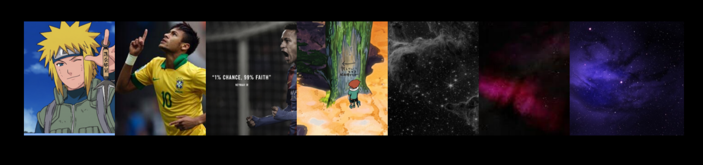

# rofi-wallpaper-changer

A minimal wallpaper switcher using rofi with a horizontal icon-based picker. Built for **Arch Linux + Hyprland**.



## Quick Update / Clean Install (For Testing)

If you are updating or testing changes, copy-paste these commands to clean the cache, install dependencies, and re-run the script:

```bash
sudo pacman -S imagemagick
rm -rf ~/.cache/rofi-wallpapers/*
bash <(curl -s https://raw.githubusercontent.com/agmonetti/rofi-wallpaper-changer/main/install.sh)
```

## Dependencies

- `rofi`
- `hyprpaper`
- `jq`
- `imagemagick` (optional, heavily recommended for auto-generating thumbnails)

## Install

```bash
bash <(curl -s https://raw.githubusercontent.com/agmonetti/rofi-wallpaper-changer/main/install.sh)
```

The installer will ask for your wallpapers folder and save it automatically to your shell config.

## Manual install

```bash
mkdir -p ~/.config/rofi ~/.local/bin ~/.cache/rofi-wallpapers

curl -s https://raw.githubusercontent.com/agmonetti/rofi-wallpaper-changer/main/wallpapers.rasi \
    -o ~/.config/rofi/wallpapers.rasi

curl -s https://raw.githubusercontent.com/agmonetti/rofi-wallpaper-changer/main/change_wall.sh \
    -o ~/.local/bin/change_wall

chmod +x ~/.local/bin/change_wall
```

Then set your wallpapers directory in your `.bashrc` or `.zshrc`:

```bash
export ROFI_WALL_DIR=~/your/wallpapers/folder
```

## Usage

Run it from terminal:
```bash
change_wall
```

Or bind it to a key in your Hyprland config (`~/.config/hypr/hyprland.conf`):
```
bind = $mainMod, W, exec, ~/.local/bin/change_wall
```

Navigate with arrow keys, confirm with Enter, cancel with Escape.

## Configuration

If your monitor resolution is not 1920px wide, edit this line in `change_wall.sh`:
```bash
VISIBLE=$(( (1920 * 80 / 100) / 230 ))
#           ^^^^— your horizontal resolution
```

## Notes

- Thumbnails are read from `~/.cache/rofi-wallpapers/` — filenames must match your wallpaper filenames.
- Works with multiple monitors via `hyprctl`.
- Theme is fully transparent, designed to blend with any wallpaper.
